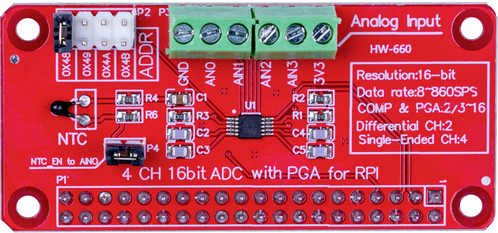

# node-red-contrib-iiot-rpi-ads1115

[](https://nodered.org)
[](https://www.raspberrypi.com/)


[](https://www.paypal.com/cgi-bin/webscr?cmd=_s-xclick&hosted_button_id=ZDRCZBQFWV3A6)

A Node-Red node for 16bit ads1115 analog to digital converter<br>



Example  **ads1115** hat from [joy-it](https://www.joy-it.net/en/products/RB-ADC01)


Example **ads1115** module

## Installation
Install with Node-Red Palette Manager or npm command:
```
cd ~/.node-red
npm install node-red-contrib-iiot-rpi-ads1115
```

## Usage
- This node works on Raspberry Pi with 32bit or 64bit OS.
- The output value is mV or adc raw data.
- For multi node, all values send as array.
- Enable I2C with raspi-config.

## Array Index on Multi Node

|Input|Array-Index
|:----|:---:|
|A0|0|
|A1|1|
|A2|2|
|A3|3|

[CHANGELOG](CHANGELOG.md)<br>