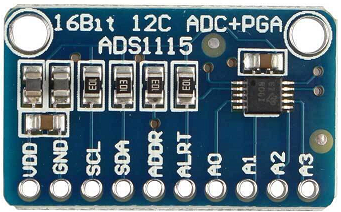

# node-red-contrib-iiot-rpi-ads1115

[](https://nodered.org)


A Node-Red node for 16bit ads1115 analog to digital converter<br>


Example  **ads1115** hat from [joy-it](https://www.joy-it.net/en/products/RB-ADC01)



Example **ads1115** module

## Installation
Install with Node-Red Palette Manager or npm command:
```
cd ~/.node-red
npm install node-red-contrib-iiot-rpi-ads1115
```

## Usage
- This node works on Raspberry Pi with 32bit or 64bit OS.
- The output value is mV or adc raw data.
- Enable I2C with raspi-config.

## Test Enviroment
- Raspberry Pi 4
- Raspberry Pi OS (64bit) Debian v11 (bullseye)
- Raspberry Pi OS (32bit) Debian v11 (bullseye)
- Node-Red: v2.2.2
- node.js: v14.19.3<br>
If you have problems with other enviroments, open issue on github.
